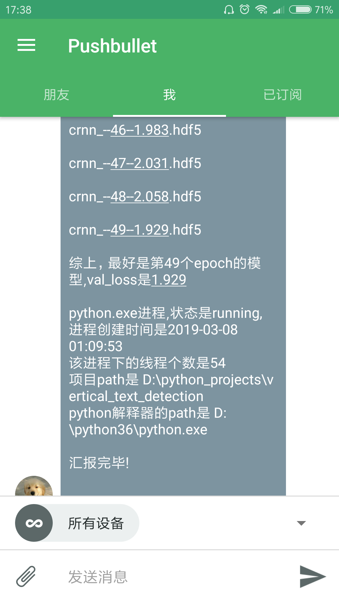

# PFMonitor -- for deep learning engineer's freedom
          
The `PFMonitor` project is aimed to free your eyes on the computer screen while you are training your neural networks. 
It designed for engineers,students and professors to  CHECK your deep learning training process just by PHONE, not sticking to the front of PCs.
This monitor contains two main features:  
1. Cross-platform. you can show the notifications on ios, android, linux, ubuntu, windows.
2. Free of use

Run the monitor script on the PCs or servers which are training some models after setting the correct parameters,   
and the monitor will check your process's status and the file list under your folder.  
If there are some changes, monitor will send notifications to the local computer and remote phone

## Getting Started
### Installing
* system: win10/Ubuntu/...
* python:3+ 
* Clone or download the repository  
* Commands to install requirements via pip wheels  
  `pip install -r requirements.txt`
* Install [pushbullet](https://www.pushbullet.com/) on PC and phone, then sign in or sign up.  
* Create the access token at the pushbullet.This access token is a api key for socket connection.
<div align=center></div>
<div align=center></div>

### Usage
What the only thing you need to do is setting the correct parameters:
```
if __name__=='__main__':
    monitor=Monitor(
        api_key='***********',#access token
        model_path='***********',folder which you wanna monitor
        pid=666# int number not string
    )
    monitor.monitor()# start monitoring.......
```
### Demo
<div align=center></div>
<div align=center></div>
<div align=center></div>

## Author
* **Chris Li** - *all work*

## License
This project is licensed under the MIT License - see the [LICENSE](LICENSE) file for details